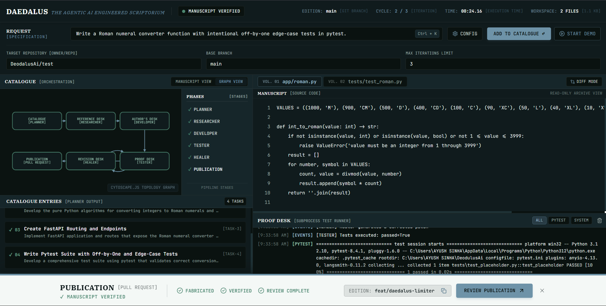
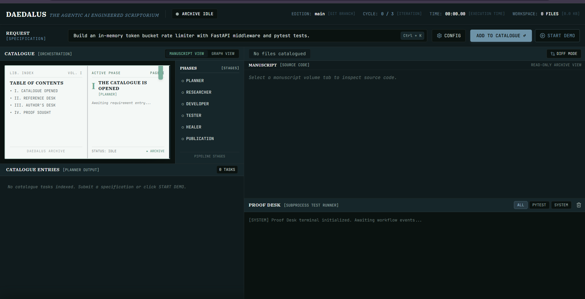
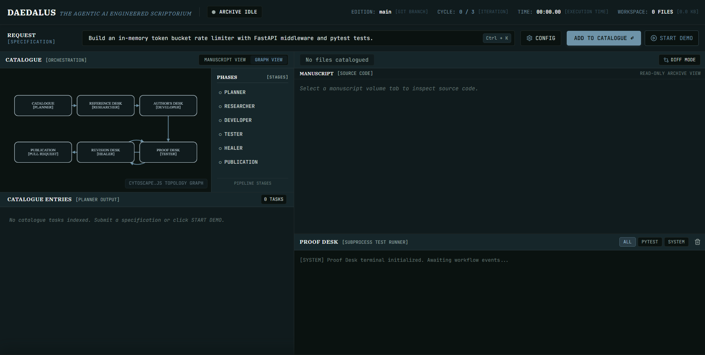

# DaedalusOS

**Turn a product requirement into a tested GitHub pull request.**

DaedalusOS is an autonomous software-engineering workflow built for teams that want an AI agent to do more than generate a code snippet. Give it a requirement and it plans the work, retrieves relevant engineering guidance, writes code and tests, executes those tests in an isolated workspace, repairs failures, and can deliver the verified patch as a GitHub pull request.

The repository name is `DeodulusAi`; the product and workflow are called **DaedalusOS**.

## Demo Screenshots

The DaedalusOS interface makes the workflow visible from an idle catalogue through verified source, test output, and publication readiness.

### Verified workflow



### Idle manuscript view



### Workflow graph view



## Why it is interesting

- **A complete engineering loop:** planning, research, implementation, testing, review, healing, and delivery are connected in one workflow.
- **Evidence before delivery:** generated code is run through real `pytest` execution before a pull request is created.
- **Bounded autonomy:** healing has a maximum retry limit, and the workflow has a configurable iteration cap.
- **Provider resilience:** Gemini, Groq, and a local Ollama model can be used through one structured-output gateway.
- **Visible execution:** the FastAPI service streams each workflow step to the browser with Server-Sent Events.
- **Operationally observable:** Prometheus metrics and a ready-to-run Grafana dashboard expose node timing, test results, healing cycles, HTTP traffic, and token usage.

## How a run works

```text
Requirement
      -> Planner -> Researcher -> Developer -> Pytest sandbox
                                                         ^             |
                                                         |       failure review
                                                         +--------- Healer
                                                                              |
                                                         passing tests -> GitHub PR
```

The workflow is implemented as a cyclic LangGraph state machine. A failed test goes through the reviewer and healer before returning to the sandbox. The graph stops when tests pass, the configured iteration limit is reached, or delivery fails.

## Our approach for judges

Most coding agents stop at text generation. DaedalusOS treats software work as a controlled delivery process: understand the request, make a plan, use relevant context, produce a patch, run the patch, learn from failures, and deliver only the verified result.

### 1. Separate responsibilities instead of using one large prompt

Each stage has one clear job and passes a typed result to the next stage:

| Stage | What it contributes | Why it matters |
| --- | --- | --- |
| Planner | Converts a vague requirement into an epic, architecture overview, and dependent tasks. | Makes the agent's intent inspectable before code is written. |
| Researcher | Retrieves implementation guidance from Qdrant, with local fallback context. | Grounds generation in reusable engineering knowledge instead of guesswork. |
| Developer | Generates complete source files and matching pytest files through structured output. | Produces an actionable patch, not an explanation or partial snippet. |
| Tester | Applies the patch to a clean workspace and runs real `pytest`. | Replaces confidence claims with executable evidence. |
| Reviewer | Extracts the useful root-cause section from failed test output. | Gives the healer focused failure information instead of an entire noisy log. |
| Healer | Generates a corrected patch from the original code and failure summary. | Closes the feedback loop and demonstrates bounded self-correction. |
| GitHub delivery | Creates a branch, writes the verified files, and opens a pull request. | Connects the demo to a normal engineering collaboration workflow. |

### 2. Architecture: producer, state graph, verifier, delivery

```text
            +----------------------+
            | FastAPI + browser UI |
            | POST /api/run        |
            | GET /api/events      |
            +----------+-----------+
               |
               v
            +----------------------+
            | LangGraph AgentState |
            | typed workflow state  |
            +----------+-----------+
               |
         +-----------------+-----------------+
         |                                   |
         v                                   v
      +--------------+                    +--------------+
      | Producer     |                    | Verifier     |
      | planner      |                    | sandbox      |
      | researcher   |                    | reviewer     |
      | developer    |                    | healer       |
      +------+-------+                    +------+-------+
         |                                   |
         +------------ CodePatch ------------+
               |
         +---------v---------+
         | GitHub PR delivery|
         +-------------------+
```

The API is intentionally thin: it validates the request, starts a background run, and streams node events. `AgentState` and the Pydantic patch models form the contract between components. The graph owns sequencing and retry decisions; producer agents create the patch; verifier agents decide whether the patch has earned delivery.

### 3. The key design decision: verification is a loop

The tester is not a final checkbox. It is a decision point in the graph:

1. If the tests pass, the patch can move to GitHub delivery.
2. If the tests fail, the reviewer compresses the failure into an actionable summary.
3. The healer uses that summary to produce a new patch.
4. The sandbox is reset and the new patch is tested again.
5. The loop stops at the configured iteration limit or the hard healing cap.

This makes the system measurable: judges can see the generated files, test output, failure summary, healing attempt, and final PR event in the live UI. It also keeps failure recovery bounded rather than allowing an unconstrained model loop.

### 4. Context and reliability strategy

The system uses three complementary context layers:

- **CAG:** the LLM gateway caches validated structured responses with a TTL and size limit.
- **RAG:** the researcher retrieves architecture guidance from Qdrant and caches formatted context.
- **MAG:** useful research context is persisted in SQLite so repeated requirements can reuse it after a restart.

Provider routing is explicit and resilient. Gemini, Groq, and Ollama can be selected per role, while fallback paths and deterministic local behavior keep development and evaluation possible without requiring every cloud service.

### 5. Trust boundaries and safety controls

- Generated paths are checked so a patch cannot escape the sandbox workspace.
- Tests run in a subprocess with a timeout and an isolated `PYTHONPATH`.
- Healing is capped at three attempts, and the overall graph iteration count is bounded.
- A run is marked `COMPLETE` only when tests pass and a pull-request URL exists.
- GitHub credentials are supplied through environment variables and are never part of generated patches.

### What to evaluate in a demo

Use a requirement with a clear behavioral outcome, such as adding a validated converter or fixing a failing calculation. Watch the event stream in this order: plan, research context, generated files, pytest result, and either delivery or a reviewer/healer cycle. The strongest evidence is not the model response; it is the passing test output and the resulting reviewable GitHub patch.

## Quickstart

### 1. Install

```bash
git clone <repo-url>
cd DeodulusAi
python -m venv .venv
# Windows PowerShell
.venv\Scripts\Activate.ps1
# macOS/Linux: source .venv/bin/activate
pip install -r requirements.txt
```

### 2. Configure

```bash
copy .env.example .env        # Windows
# cp .env.example .env        # macOS/Linux
```

At minimum, configure one LLM provider. For Gemini through your Google Cloud billing account, use Application Default Credentials (ADC), not an API key:

```bash
gcloud auth application-default login
gcloud config set project YOUR_GCP_PROJECT_ID
```

Set `GOOGLE_CLOUD_PROJECT` in `.env` to the project that owns your Gemini/Vertex AI billing and enable the Vertex AI API in that project. The application uses Vertex AI's `global` location by default so the latest Gemini models are available. Add `GITHUB_TOKEN` and `GITHUB_REPO` only when you want the workflow to open pull requests.

### 3. Start the API and UI

```bash
python -m uvicorn app.main:app --reload --port 8000
```

Open <http://127.0.0.1:8000> and enter your requirement in the **Request** field. Add the target as `owner/repository`, keep the base branch as `main`, choose an iteration limit, and select **Start Demo**. The browser UI starts a run and follows its live event stream through planning, research, code generation, testing, healing, and optional pull-request delivery.

For a first smoke test, enter:

```text
Build an in-memory token bucket rate limiter with FastAPI middleware and pytest tests.
```

The UI can run the workflow without GitHub delivery when `GITHUB_TOKEN` and `GITHUB_REPO` are omitted. When delivery is enabled, use a repository where the configured token has permission to create branches and pull requests.

To call the API directly:

```bash
curl -X POST http://127.0.0.1:8000/api/run ^
   -H "Content-Type: application/json" ^
   -d "{\"prompt\":\"Add input validation to the calculator\",\"max_iterations\":3,\"target_repo\":\"owner/repository\"}"
```

The response contains a `run_id`. Subscribe to `GET /api/events?run_id=<run_id>` to receive newline-delimited SSE events. API metrics are available at `GET /metrics`.

## Provider configuration

The gateway chooses a provider from the model setting and falls back when a provider is unavailable:

| Setting | Purpose |
| --- | --- |
| `GEMINI_AUTH_MODE` | Gemini authentication mode; defaults to `adc` and uses Vertex AI ADC |
| `GOOGLE_CLOUD_PROJECT` | GCP project billed for Gemini through Vertex AI |
| `GOOGLE_CLOUD_LOCATION` | Vertex AI location, default `global` for access to the latest Gemini models |
| `GEMINI_MODEL` | Primary Gemini model; the current default is `gemini-3.8-flash` |
| `GEMINI_FALLBACK_MODEL` | Gemini fallback model; the current default is `gemini-3.5-flash` |
| `GEMINI_TIMEOUT_SECONDS` | Vertex request timeout, default `60` seconds |
| `LLM_CACHE_PATH` | Persistent SQLite CAG response cache, default `sandbox/llm_cache.sqlite3` |
| `LLM_CACHE_TTL_SECONDS` / `LLM_CACHE_SIZE` | Persistent and in-memory cache expiry and entry limit |
| `GROQ_API_KEY` | Groq-compatible fallback generation |
| `DEVELOPER_MODEL` | Model used to generate source and tests; defaults to `gemini-3.8-flash` through Vertex AI |
| `PLANNER_MODEL` | Model used to turn a prompt into tasks |
| `HEALER_MODEL` | Model used to repair a failing patch |
| `LOCAL_LLM_MODEL` | Ollama model name when using a `local:` model |
| `QDRANT_URL` / `QDRANT_API_KEY` | Optional hosted vector search |
| `MAG_MEMORY_PATH` | SQLite path for persistent research memory |
| `GITHUB_TOKEN` / `GITHUB_REPO` | Optional pull-request delivery |

Planner, developer, and healer agents use Gemini through Vertex AI ADC by default. Validated responses are cached in memory and persisted to SQLite, so repeated prompts can reuse planning, code, and healing results across workflow runs and restarts. Cache entries are scoped by schema, model, and prompt, expire by TTL, and are discarded if they no longer validate. For a local Ollama developer, use a model selector such as `DEVELOPER_MODEL=local:qwen2.5:7b`. If no provider is available, the gateway includes narrowly scoped offline support for the Roman numeral, token-bucket, and calculator demo requirements; unrelated code-generation requests are rejected rather than given a generic patch.

## Run tests

```bash
python -m pytest -q
```

The tests cover the gateway, local-model routing, research and memory behavior, sandbox execution, and GitHub configuration. Generated code is tested separately inside `sandbox/workspace`.

## Monitoring

Start Prometheus and Grafana with Docker Compose:

```bash
docker compose -f docker-compose.monitoring.yml up -d
```

- Prometheus: <http://127.0.0.1:9090>
- Grafana: <http://127.0.0.1:3000> (`admin` / `admin` for the local default)

See [infra/README.md](infra/README.md) for the scrape configuration and dashboard details.

## Repository map

- [app/README.md](app/README.md): API, graph, schemas, and application boundaries.
- [app/producer/README.md](app/producer/README.md): planning, research, memory, and model gateway.
- [app/verifier/README.md](app/verifier/README.md): testing, failure review, healing, and GitHub delivery.
- [app/observability/README.md](app/observability/README.md): Prometheus instrumentation.
- [tests/README.md](tests/README.md): test suite guide.
- [static/README.md](static/README.md): browser client guide.
- [sandbox/README.md](sandbox/README.md): generated-workspace and persistent-memory behavior.
- [infra/README.md](infra/README.md): Prometheus and Grafana setup.

## Project status

This is an active prototype for exploring autonomous software delivery. Treat generated patches as proposed changes: review the resulting pull request, keep credentials out of `.env` files committed to Git, and use a restricted GitHub token for demonstrations.